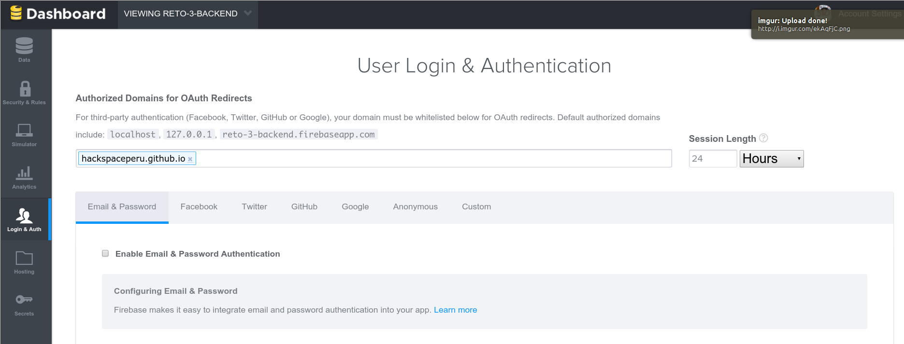
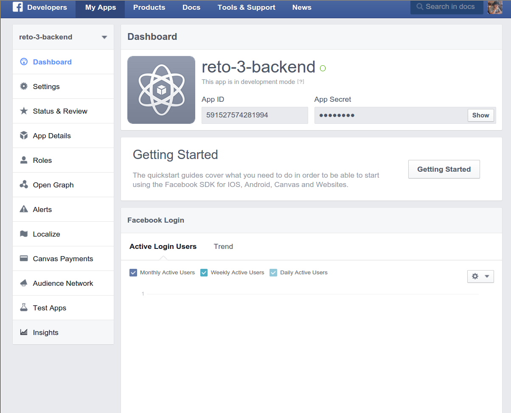
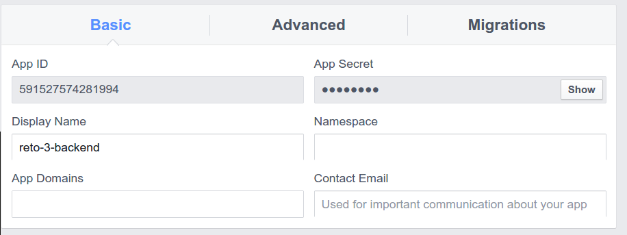

# Implementación de OAuth con Firebase

<!-- markdown-toc start - Don't edit this section. Run M-x markdown-toc/generate-toc again -->
**Table of Contents**

- [Python contribution layer for Spacemacs](#python-contribution-layer-for-spacemacs)
    - [Description](#description)
    - [Install](#install)

<!-- markdown-toc end -->
## Recapitulando

En el reto anterior al menos deben recordar como hacen la conexión con
firebase en el frontend de su página web, bueno ahora tendrán que
implementar por su cuenta la integración con Facebook y Twitter,
obviamente. Sólo explicaremos uno de ellos.

Pero de que sirve una autentificación si no haces nada al respecto,
normalmente se usa esto para saber la identidad del usuario y luego
tomar diversas decisiones acerca del status de este usuario en tu
plataforma o en tu página web (por ejemplo un autor, editor en un
blog, o un usuario premium o uno trial en un producto)

Sin embargo, ya que se acerca san valentin les explicare aqui como
haríaan para darle acceso SÓLO a una persona especial a su website,
esto servira como ejemplo para que luego ustedes puedan hacer sus
propias cosas para saber si un usuario es premium o no haciendo
queries basicos del id del usuario en su plataforma.

## Entregable

El reto es implementar OAuth en su página web, y tener dos tipos de
usuarios, unos premium y otros que no son premium. Y mostrar cosas
diferentes para cada uno. Basta con un mensaje de: Oye eres usuario
premium. La forma de como serán llenados los usuarios lo pueden hacer
como gusten, hardcodeando los ids de los usuarios en su archivo de js
que se importa en la pagina web, o usando una base de datos en
firebase con la estructura que tenían en el reto anterior. No es
necesario tener mucha seguridad en este paso, sin embargo si quieren
saber la solución más segura, obviamente es la de tener una base de
datos en firebase y hacer queries a ella teniendo solo permisos de
lectura, más informacioón en la
[documentación][https://www.firebase.com/docs/security/quickstart.html]

## Haciendo una página web para Manuel@ (O tu persona especial de elección)

### Creando tu Firebase App

Ya cubrieron esto en el reto anterior ahora sólo tendrán que tener en
cuenta que su app tiene que tener un dominio, al cual se harán las
cosas de OAuth, así que tendrán que configurar eso en Firebase.

Basta con poner el URL que usarán para su web en este campo, nosotros
estamos usando github-pages para este ejemplo así que se ve así:



Ojo que es muy importante tener el nombre de su firebase, porque paa
facebook tendremos que utilizar el siguiente callback

`https://auth.firebase.com/v2/<aquí el nombre de tu firebase>/auth/facebook/callback`

En nuestro caso:

`https://auth.firebase.com/v2/reto-3-backend/auth/facebook/callback`

### Creando un Facebook App 

Si vamos a hacer un login con fb primero tendremos que crear una app de FB para eso, así que van a la página de Facebook [Developers]( developers.facebook.com ) (developers.facebook.com) y le dan a crear nueva app. Como es su primera vez, los guiaré.

Tendrán esta vista, vayan a por Website


Luego ponganle el nombre de su nueva app


En la siguiente parte eligan una categoría y denle a Crear App ID.

Luego de esto le dan a Skip QuickStart o Saltar Inicio Rápido. Lo importante es que lleguen a esta página al final.



Ojo que este proceso puede variar en apariencia ya que facebook siempre está actualizando la plataforma para desarrolladores.

Aquí seleccionarán Settings (o Ajustes) en el dashboard.



Luego tendrán que llenarlo con la URL que usarán, poner un email de confirmación(para luego poder hacer su app pública y que no sólo la puedan usar ustedes)


Ahora entren a opciones Avanzadas, y coloquen el callback en donde se debe:


Ya están listos para comenzar a usar OAuth en firebase

### CODING TIME

El ejemplo lo tienen arriba, pueden revisar reto.js y reto.css. Si
tienen dudas pueden revisar la documentación de [firebase](
https://www.firebase.com/docs/web/guide/login/facebook.html ).

### Conectando a Firebase

Primero hacen la conexión como siempre

`var ref = new Firebase("https://<tu app de firebase aquí>.firebaseio.com")`

luego tienen que meter todas las cosas que pasarán con la autentificación dentro de un callback de esta referencia a la conexión:

``` js
ref.onAuth(function(authData) {
    if (authData) {
        // user authenticated with Firebase
        (...)
        }
    else{
        // user is logged out
        (...)
        }
```
    
